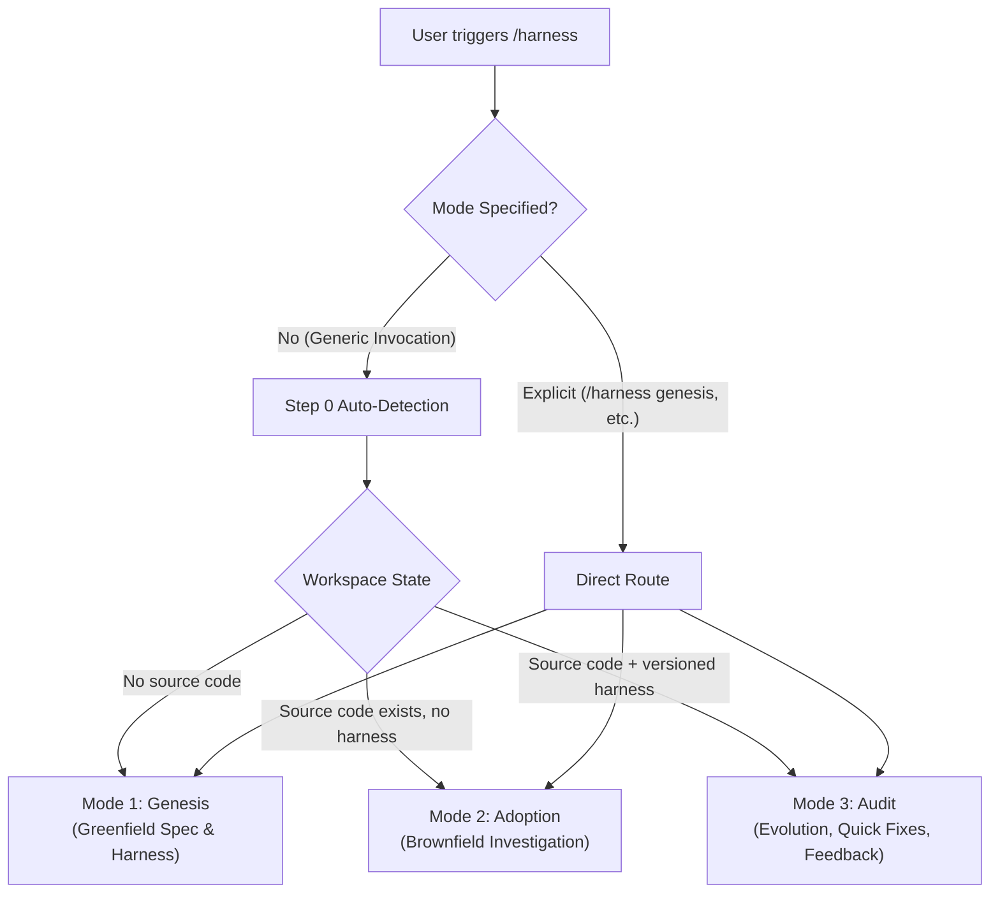

# 🛡️ Antigravity Harness Builder

> **A general-purpose meta-agent system for Google Antigravity (and modern AI coding assistants) that designs, adopts, and audits multi-agent development harnesses.**

[](https://antigravity.google)
[](#architecture)
[](LICENSE)

The **Harness Builder** establishes a project-specific development harness: a deterministic governance system of **work-routing tracks**, **specialized roles**, **hard invariants**, **verification gates**, and **circuit breakers** that dictates how future AI agents complete tasks in any codebase.

---

## 🚀 Key Highlights

* **100% Derived Fresh**: Carries zero hardcoded assumptions about tech stacks, track counts, or role names. Every rule and boundary is derived directly from user intent or codebase reality.
* **Progressive Disclosure Architecture**: Lean root skill (~10 KB) that dynamically pulls structured reference manuals on demand, saving up to ~86% of initial prompt context window overhead.
* **First-Class Antigravity 2.0 Integration**: Native slash commands (`/harness`), direct mode selection, subagent definitions with model tiering (`flash` vs `pro`), and `.agents/hooks.json` lifecycle gates.
* **Multi-Tool Portability**: Step 3.6 inspects the host environment (Antigravity, Claude Code, Cursor, Windsurf) *before* deriving roles, mapping rules onto the host's actual native primitives.
* **Anti-Sycophancy & High Rigor**:
  * **Zero Code Writes**: Meta-agents only write governance and planning configs, never application code.
  * **Dual-Gating**: Irreversible operations (financial, legal, destructive) require pre-work order inspection and post-implementation audits.
  * **Deliberate Ambiguity Dry-Runs**: Synthetically tests whether the generated harness halts on ambiguous instructions rather than making unverified guesses.
  * **Interruption & Resume Protocol**: Append-only checkpointing to recover cleanly from disconnections without redoing work or hallucinating completion.

---

## 📂 Repository Layout

```text
harness-builder/
├── SKILL.md                          # Root orchestrator & Antigravity entrypoint
├── README.md                         # Project documentation
├── .gitignore                        # Git ignore patterns
└── references/
    ├── mode1_genesis.md              # Greenfield projects (Adaptive fatigue-mitigated discussion)
    ├── mode2_adoption.md             # Brownfield projects (Read-only codebase investigation)
    ├── mode3_audit.md                # Continuous evolution (Full Audit 3a, Quick Fix 3b, Behavior Feedback 3c)
    ├── decision_procedure.md         # Deterministic derivation procedure & Step 4.1 self-consistency audit
    ├── dry_run_verification.md       # Synthetic checks & halt-on-ambiguity verification
    └── antigravity_primitives.md     # First-class Antigravity 2.0 mapping reference
```

---

## 🔄 The 3 Operational Modes

The Harness Builder operates in three distinct modes:



### 1. Mode 1 — Genesis (Greenfield / New Projects)
* **When**: No meaningful source code exists yet.
* **Adaptive Pacing**: Avoids survey fatigue by bundling the 8 discovery topics into 3–4 logical blocks when upfront context is rich, or stepping through sequentially when the idea is brief.
* **Deliverable**: A comprehensive `PROJECT_SPEC.md` and derived harness.

### 2. Mode 2 — Adoption (Brownfield / Existing Projects)
* **When**: Code exists but lacks a structured, versioned harness.
* **Zero-Write Rule**: Deep read-only analysis of modules, data flows, and test commands.
* **Hypotheses Over Conclusions**: Discovered anomalies are framed as hypotheses to uncover invisible constraints, tribal knowledge, and near-misses.

### 3. Mode 3 — Audit (Continuous Evolution)
* **When**: An existing harness needs adjustment.
* **Three Targeted Sub-Modes**:
  * **3a. Full Audit**: Re-evaluates harness against major architectural drift.
  * **3b. Quick Fix**: Low-overhead factual updates (e.g. test runner renamed, path moved).
  * **3c. Behavior Feedback (Highest Scrutiny)**: Evaluates requests like *"this rule is too strict"* against hard invariants to prevent accidental erosion of safety guardrails.

---

## ⚡ Antigravity 2.0 Quickstart & Installation

### Global Installation (Available across all projects)
Symlink this repository into Antigravity's global customization directory:

```bash
# 1. Create global skills directory
mkdir -p ~/.gemini/config/skills

# 2. Symlink the harness builder
ln -sf "$(pwd)" ~/.gemini/config/skills/harness
ln -sf "$(pwd)" ~/.gemini/config/skills/harness-builder
```

### Invocation Commands in Chat
Type `/` in the Antigravity 2.0 chat canvas to trigger autocomplete:

```text
/harness              # Auto-detects mode based on current workspace
/harness genesis      # Forces Mode 1 (New project spec)
/harness adopt        # Forces Mode 2 (Existing codebase investigation)
/harness audit        # Forces Mode 3 (Audit, quick-fix, or behavior adjustment)
/harness quickfix     # Jumps directly to Sub-mode 3b
```

Alternatively, direct specialized commands can be used:
* `/harness-genesis`
* `/harness-adopt`
* `/harness-audit`

---

## 🏗️ Generated Harness Output

When approved in **Step 5**, the builder generates an idiomatic project harness tailored to your host tool. In Antigravity 2.0, it generates:

```text
<workspace_root>/
├── AGENTS.md                         # Always-on orchestrator, routing, & resume protocol
├── PROJECT_SPEC.md                   # Grounded project specification
├── HARNESS_RATIONALE.md              # Design rationale for all tracks and invariants
├── ONBOARDING.md                     # Practical quick-reference for developers
└── .agents/
    ├── checkpoint.json               # Active task state and evidence log
    ├── harness_log.json              # Version history and audit trail
    ├── hooks.json                    # Deterministic gating hooks
    └── skills/
        ├── <track-1>/
        │   └── SKILL.md              # Track workflow & verification command
        └── <track-2>/
            └── SKILL.md              # Track workflow & verification command
```

---

## 🛡️ Core Non-Negotiables

1. **No Unapproved Writes**: Enforcement configs are never written to disk without the Step 5 human approval checkpoint.
2. **Investigation Is Not Intent**: Code patterns are treated as hypotheses, never ground truth.
3. **No Guessing on Invariants**: Ambiguities on critical tracks halt execution and escalate to open questions.
4. **Environment First**: Step 3.6 environment detection must run before Step 4 derivation to prevent hallucinating un-executable mechanisms.
5. **Mandatory Halt-on-Ambiguity Check**: Step 6 synthetically verifies that the harness halts on deliberate ambiguity before declaring the build complete.

---

## 📄 License

MIT License. See [LICENSE](LICENSE) for details.
