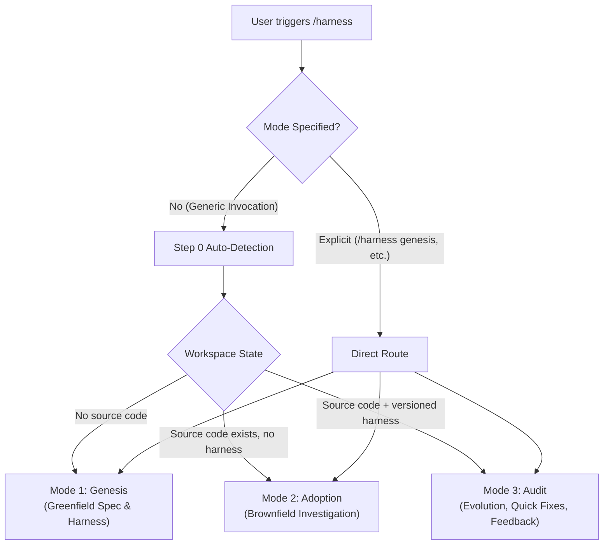

# 🛡️ Antigravity Harness Builder/Auditor

> **A general-purpose meta-agent system for Google Antigravity (and modern AI coding assistants) that designs, adopts, and audits multi-agent development harnesses.**

[](https://antigravity.google)
[](#architecture)
[](LICENSE)

The **Harness Builder** establishes a project-specific development harness: a deterministic governance system of **work-routing tracks**, **specialized roles**, **hard invariants**, **verification gates**, and **circuit breakers** that dictates how future AI agents complete tasks in any codebase.

---

## 🚀 Key Highlights

* **100% Derived Fresh**: Carries zero hardcoded assumptions about tech stacks, track counts, or role names. Every rule and boundary is derived directly from user intent or codebase reality.
* **Progressive Disclosure Architecture**: Lean root skill (~10 KB) that dynamically pulls structured reference manuals on demand, saving up to ~86% of initial prompt context window overhead.
* **First-Class Antigravity 2.0 Integration**: Native slash commands (`/harness`), direct mode selection, subagent definitions with model tiering (`flash` vs `inherit`), and `.agents/hooks.json` lifecycle gates as a mandatory (not optional) enforcement layer for every Hard Invariant.
* **Multi-Tool Portability**: Step 3.6 inspects the host environment (Antigravity, Claude Code, Cursor, Windsurf/Devin Desktop) *before* deriving roles, mapping rules onto the host's actual native primitives via a dedicated reference file per tool. Unlisted hosts fall through to a structured investigation procedure ([references/generic_tool_primitives.md](references/generic_tool_primitives.md)) rather than unguided improvisation, and every mapping discloses which guarantees are mechanically enforced (real hooks, real subagent isolation) versus advisory-only for that specific host.
* **Anti-Sycophancy & High Rigor**:
  * **Zero Code Writes**: Meta-agents only write governance and planning configs, never application code.
  * **Interactive UI Modals**: Uses the host's native interactive questioning tool (e.g. Antigravity's `ask_question`) where available for stack choices, gap confirmations, and approvals rather than dumping static text questionnaires; falls back to an explicit wait-for-reply procedure on hosts without one.
  * **Dual-Gating**: Irreversible operations (financial, legal, destructive) require pre-work order inspection and post-implementation audits.
  * **Evidence-Cited Self-Audit**: Step 4.1 answers every checklist item by citing the specific line/file that satisfies it — a bare "PASS" is treated as a failure, not a pass.
  * **Provenance-Tagged Invariants**: Every hard invariant carries `[user-confirmed]`, `[code-evidence + confirmed]`, or `[near-miss-derived]`; an untagged invariant was silently promoted from a hypothesis and is rejected before shipping.
  * **Traceable Tool Scoping**: Every tool granted to a role carries a written justification tying it back to a concrete verification need — no tool ships without a citation.
  * **Deliberate Ambiguity Dry-Runs**: Synthetically tests whether the generated harness halts on ambiguous instructions rather than making unverified guesses.
  * **Circuit Breaker Protocol**: Persistent, resume-proof attempt counters per gate (not per track) with a fixed ceiling, mandatory breach escalation, and a synthetic breach dry-run before shipping.
  * **Mechanical Enforcement Protocol**: Every Hard Invariant and dual-gated track ships with at least one real, executable enforcement artifact — a host-native blocking hook, a git pre-commit hook, and/or a CI check — never rule text alone. Step 6 actually executes each artifact against a synthetic pass and fail case before the build can be declared complete, so a stub script that always allows is caught rather than trusted.
  * **Complexity Budget Pass**: Track/role count is actively tested for consolidation and explicitly surfaced to the human past a threshold, rather than growing silently.
  * **Versioning & Reference Integrity**: Every structural change (rename/merge/split/remove) writes a schema'd changelog entry and cannot complete until a scan confirms no file still points at the old name.
  * **Interruption & Resume Protocol**: Append-only checkpointing to recover cleanly from disconnections without redoing work or hallucinating completion.

---

## 📂 Repository Layout

```text
harness-builder/
├── SKILL.md                          # Root orchestrator & Antigravity entrypoint
├── README.md                         # Project documentation
├── .gitignore                        # Git ignore patterns
└── references/
    ├── mode1_genesis.md              # Greenfield projects (Adaptive fatigue-mitigated discussion)
    ├── mode2_adoption.md             # Brownfield projects (Read-only codebase investigation)
    ├── mode3_audit.md                # Continuous evolution (Full Audit 3a, Quick Fix 3b, Behavior Feedback 3c)
    ├── decision_procedure.md         # Deterministic derivation procedure & Step 4.1 self-consistency audit
    ├── dry_run_verification.md       # Synthetic checks & halt-on-ambiguity verification
    ├── antigravity_primitives.md     # Antigravity 2.0 mapping reference
    ├── claude_code_primitives.md     # Claude Code mapping reference (subagents, hooks)
    ├── cursor_primitives.md          # Cursor mapping reference (subagents, hooks)
    ├── windsurf_primitives.md        # Windsurf/Devin Desktop mapping reference (Cascade vs. Devin Local detection, Subagents-toggle-aware)
    └── generic_tool_primitives.md    # Investigation procedure for any unlisted host
```

---

## 🔄 The 3 Operational Modes

The Harness Builder operates in three distinct modes:



### 1. Mode 1 — Genesis (Greenfield / New Projects)
* **When**: No meaningful source code exists yet.
* **Adaptive Pacing**: Avoids survey fatigue by bundling the 8 discovery topics into 3–4 logical blocks when upfront context is rich, or stepping through sequentially when the idea is brief.
* **Deliverable**: A comprehensive `PROJECT_SPEC.md` and derived harness.

### 2. Mode 2 — Adoption (Brownfield / Existing Projects)
* **When**: Code exists but lacks a structured, versioned harness.
* **Zero-Write Rule**: Deep read-only analysis of modules, data flows, and test commands.
* **Hypotheses Over Conclusions**: Discovered anomalies are framed as hypotheses to uncover invisible constraints, tribal knowledge, and near-misses.

### 3. Mode 3 — Audit (Continuous Evolution)
* **When**: An existing harness needs adjustment.
* **Three Targeted Sub-Modes**:
  * **3a. Full Audit**: Re-evaluates harness against major architectural drift.
  * **3b. Quick Fix**: Low-overhead factual updates (e.g. test runner renamed, path moved).
  * **3c. Behavior Feedback (Highest Scrutiny)**: Evaluates requests like *"this rule is too strict"* against hard invariants to prevent accidental erosion of safety guardrails.

---

## ⚡ Quickstart & Installation Guides

Install the Harness Builder globally so it is available across **every** project in Antigravity 2.0.

### 🐧 Linux / macOS Quickstart

Run in your terminal (Bash/Zsh):

```bash
# 1. Clone the repository (if not already local)
git clone https://github.com/ahmedashraf0001/harness-builder.git ~/harness-builder
cd ~/harness-builder

# 2. Create Antigravity's global skills directory
mkdir -p ~/.gemini/config/skills

# 3. Create global symlinks (live sync with repo updates)
ln -sf "$(pwd)" ~/.gemini/config/skills/harness
ln -sf "$(pwd)" ~/.gemini/config/skills/harness-builder
```

---

### 🪟 Windows Quickstart

Open **PowerShell** (Run as Administrator for symlinks):

```powershell
# 1. Clone the repository (if not already local)
git clone https://github.com/ahmedashraf0001/harness-builder.git "$HOME\harness-builder"
Set-Location "$HOME\harness-builder"

# 2. Create Antigravity's global skills directory
New-Item -ItemType Directory -Force -Path "$HOME\.gemini\config\skills"

# 3. Create global directory junctions/symlinks
New-Item -ItemType SymbolicLink -Path "$HOME\.gemini\config\skills\harness" -Target "$PWD" -Force
New-Item -ItemType SymbolicLink -Path "$HOME\.gemini\config\skills\harness-builder" -Target "$PWD" -Force
```

*(Note: If Developer Mode is disabled on Windows and you cannot create symlinks, create a Junction with `cmd /c mklink /J "%USERPROFILE%\.gemini\config\skills\harness" "%USERPROFILE%\harness-builder"`).*

---

### Invocation Commands in Chat
Type `/` in the Antigravity 2.0 chat canvas to trigger autocomplete:

```text
/harness              # Auto-detects mode based on current workspace
/harness genesis      # Forces Mode 1 (New project spec)
/harness adopt        # Forces Mode 2 (Existing codebase investigation)
/harness audit        # Forces Mode 3 (Audit, quick-fix, or behavior adjustment)
/harness quickfix     # Jumps directly to Sub-mode 3b
```

Alternatively, direct specialized commands can be used:
* `/harness-genesis`
* `/harness-adopt`
* `/harness-audit`
* `/harness-quickfix`

---

## 🏗️ Generated Harness Output

When approved in **Step 5**, the builder generates an idiomatic project harness tailored to your host tool. In Antigravity 2.0, it generates:

```text
<workspace_root>/
├── AGENTS.md                         # Always-on orchestrator, routing, & resume protocol
├── PROJECT_SPEC.md                   # Grounded project specification
├── HARNESS_RATIONALE.md              # Design rationale for all tracks and invariants
├── ONBOARDING.md                     # Practical quick-reference for developers
└── .agents/
    ├── checkpoint.json               # Active task state and evidence log
    ├── harness_log.json              # Append-only structured changelog (version, change_type, entities_affected, rationale)
    ├── hooks.json                    # Deterministic gating hooks (mandatory for Hard Invariants — real scripts, not stubs)
    └── skills/
        ├── <track-1>/
        │   └── SKILL.md              # Track workflow & verification command
        └── <track-2>/
            └── SKILL.md              # Track workflow & verification command
```

---

## 🛡️ Core Non-Negotiables

1. **No Unapproved Writes**: Enforcement configs are never written to disk without the Step 5 human approval checkpoint.
2. **Investigation Is Not Intent**: Code patterns are treated as hypotheses, never ground truth.
3. **No Guessing on Invariants**: Ambiguities on critical tracks halt execution and escalate to open questions.
4. **Environment First**: Step 3.6 environment detection must run before Step 4 derivation to prevent hallucinating un-executable mechanisms.
5. **Mandatory Halt-on-Ambiguity Check**: Step 6 synthetically verifies that the harness halts on deliberate ambiguity before declaring the build complete.
6. **Evidence Over Self-Report**: Step 4.1 checklist items, tool grants, and invariants are only valid when cited against a written artifact — a bare "PASS" or an untagged invariant fails the check.
7. **Mandatory Circuit Breaker Check**: Step 6 synthetically verifies each gate's attempt ceiling actually halts and escalates on breach, with counters that survive a session restart.
8. **No Unreported Sprawl**: Track/role count past the complexity-budget guideline must be surfaced to the human explicitly, never buried silently.
9. **No Silent Renames**: A rename, merge, split, or removal of any track/role/invariant is not complete until the Reference Integrity Scan confirms no stale reference remains.
10. **No Rule-Text-Only Invariants**: A Hard Invariant or dual-gated track ships only with at least one real enforcement artifact (host-native hook, git pre-commit hook, and/or CI check) — never rule text alone. Stub scripts that unconditionally allow are treated as a failed check, not a passed one.
11. **Mandatory Mechanical Enforcement Check**: Step 6 actually executes every generated enforcement artifact against a synthetic pass case and a synthetic fail case before the build can be declared complete.

---

## 📄 License

MIT License. See [LICENSE](LICENSE) for details.
